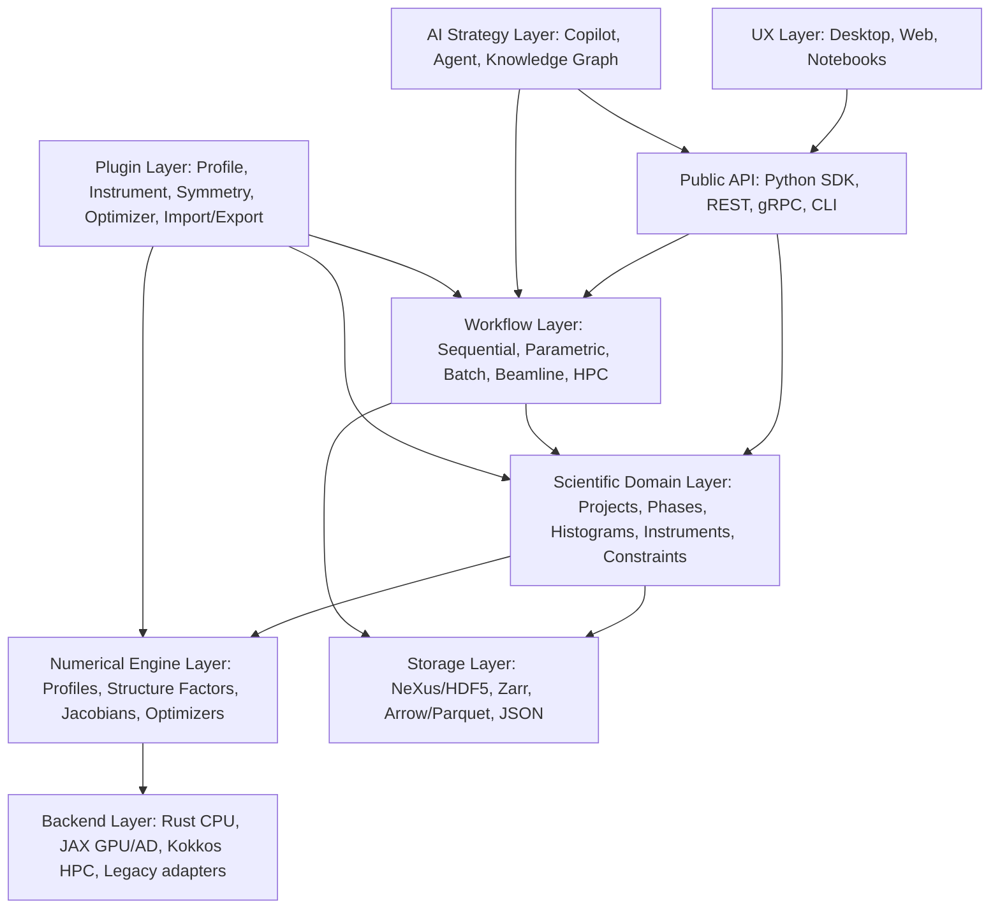
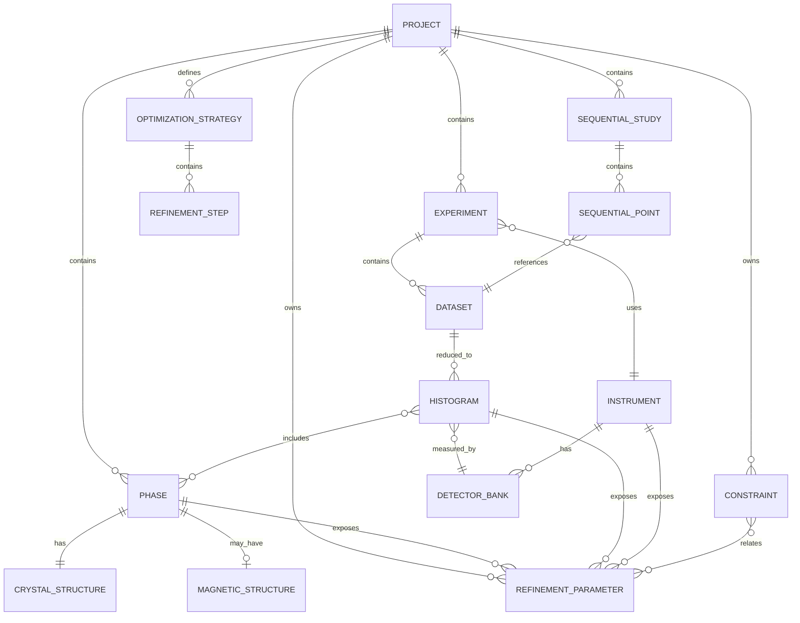
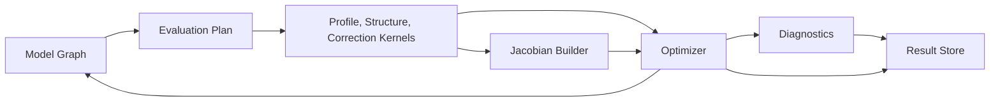
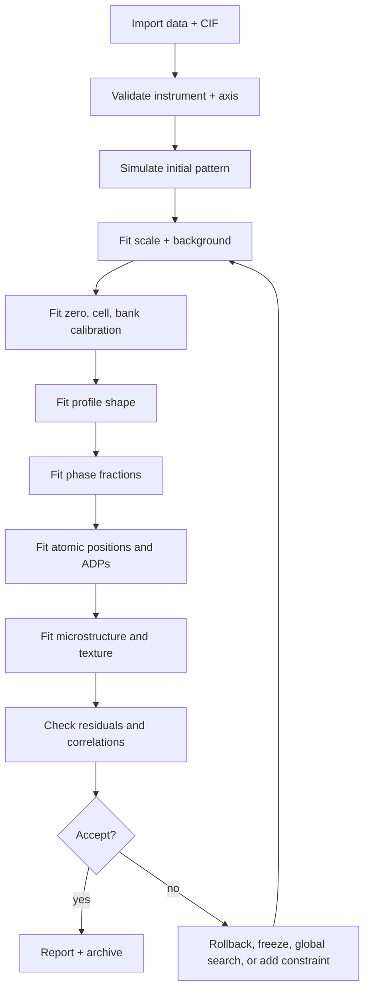
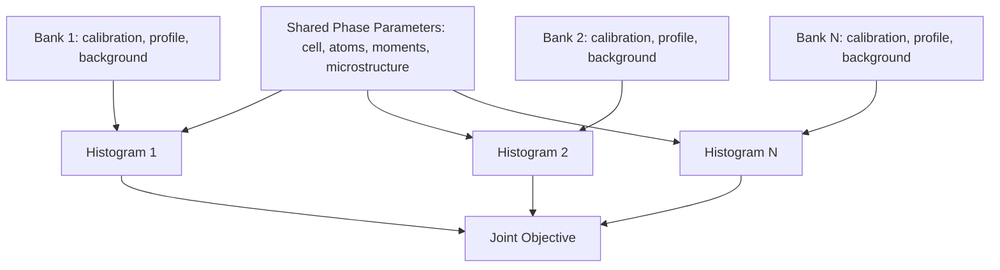
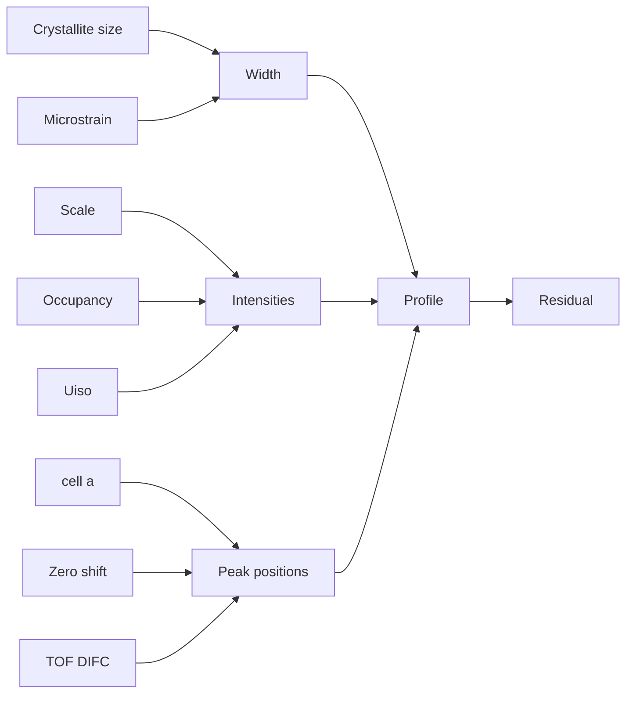
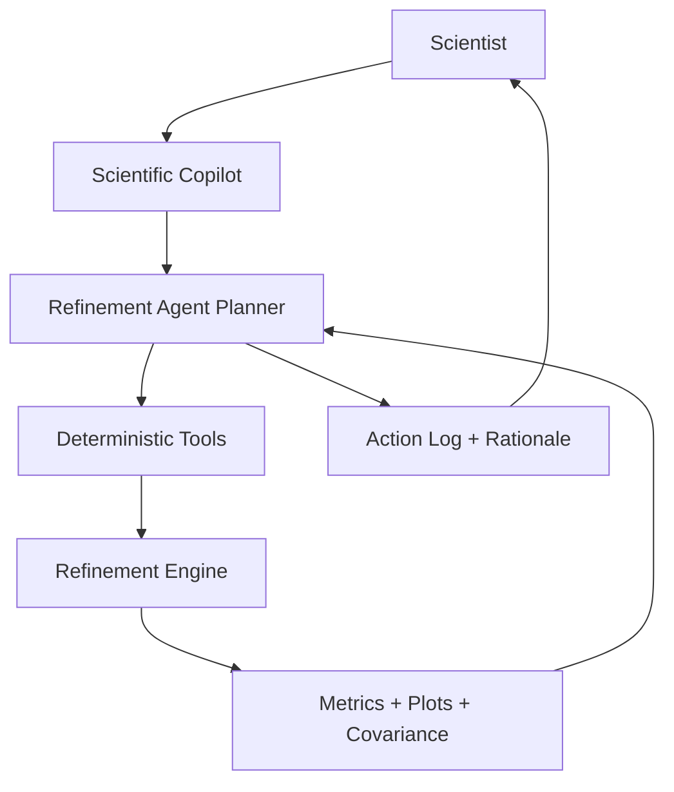

# Executive Thesis

The next major Rietveld platform should not be a prettier clone of GSAS-II, FullProf, TOPAS, MAUD, or Mantid-based workflows. It should be a scientific operating system for diffraction refinement: a reproducible model graph, differentiable numerical engine, instrument-aware data model, autonomous strategy layer, and modern interactive UX that can run locally, at beamlines, on HPC clusters, and in cloud-native high-throughput environments.

The central design principle is:

> Separate scientific model semantics from numerical kernels, workflow orchestration, user interface, and AI strategy.

Existing systems prove that each capability is possible. GSAS-II demonstrates breadth, scripting, and joint X-ray/neutron workflows; FullProf demonstrates magnetic and neutron maturity; TOPAS demonstrates an elegant constraint and computer-algebra refinement architecture; MAUD demonstrates combined texture and microstructure analysis; Mantid demonstrates neutron facility data reduction at scale; Spotlight and Rongzai show the direction of HPC- and AI-assisted refinement. The opportunity is to combine these lessons into a modular, auditable, high-performance platform rather than another monolithic desktop application.

The proposed system, referred to here as **Rietveld Next**, should be:

- **Schema-first**: every project, parameter, constraint, histogram, instrument, and action has a typed representation.
- **API-first**: every GUI action is scriptable and every script action is visible in the GUI.
- **Instrument-aware**: CW XRD, synchrotron XRD, EDXRD, CW neutron, TOF neutron, and multi-bank instruments are first-class models.
- **Refinement-graph based**: parameters are nodes in a dependency graph rather than opaque entries in a flat table.
- **HPC-capable**: local desktop, workstation, Slurm clusters, Dask/Ray workflows, and Kubernetes deployments use the same model semantics.
- **AI-native but physics-grounded**: LLM agents may recommend strategies and explain results, but deterministic physics engines produce the numerical results.

# Part 1: Foundational Literature Review

## 1.1 Core Mathematical Formulation

A modern Rietveld engine should treat a calculated profile as a composable forward model:

$$
y_i^{calc} = b_i(\theta_b) + \sum_{h \in H}\sum_{p \in P}\sum_{r \in R_{hp}} s_{hp} M_{hpr} L_{hpr} A_{hpr} P_{hpr} |F_{hpr}(\theta_s)|^2 \Phi(x_i - x_{hpr}; \theta_{inst}, \theta_{sample}, \theta_{micro})
$$

where $b_i$ is background, $h$ indexes histograms or datasets, $p$ phases, $r$ reflections, $F$ structure factors, $\Phi$ the profile function or convolution kernel, and $\theta$ all refinable structural, instrumental, sample, and microstructural parameters.

The generalized objective should support least squares, robust loss, Poisson likelihood, Bayesian priors, restraints, and physical constraints:

$$
\mathcal{L}(\theta) = \sum_i \rho\left(\frac{y_i^{obs} - y_i^{calc}(\theta)}{\sigma_i}\right) + \lambda R(\theta) - \log p(\theta)
$$

with equality and inequality constraints:

$$
g(\theta)=0, \qquad l \le \theta \le u, \qquad h(\theta) \ge 0
$$

The crucial architectural implication is that Rietveld refinement is not only nonlinear least squares. It is a constrained inverse problem with coupled physical submodels, correlated errors, sequential expert decisions, and model-selection uncertainty.

## 1.2 Foundational Theory and Program-Defining Publications

### Rietveld 1969

**Citation:** Rietveld, H. M. (1969). "A profile refinement method for nuclear and magnetic structures." *Journal of Applied Crystallography*, 2, 65-71. DOI: 10.1107/S0021889869006558.

**Contribution:** Introduced whole-profile least-squares refinement for powder neutron diffraction, replacing reliance on extracted integrated intensities in heavily overlapped powder patterns.

**Mathematical innovation:** Model the entire diffraction profile directly and refine structural and instrumental parameters simultaneously against all observed points.

**Software implications:** The calculated profile must be the central object. Peak overlap, background, scale, structure factor, profile shape, and instrument response cannot be treated as independent post-processing steps.

**Strengths:** Solves the central problem of peak overlap in powder diffraction and created the basis of modern quantitative phase and structure refinement.

**Limitations:** Classical formulation assumes relatively simple weighting and relies strongly on expert-driven refinement order.

**Current relevance:** Still the root of all Rietveld platforms.

**Lesson:** Preserve whole-profile rigor, but modernize likelihoods, constraints, uncertainty, and automation.

### Young, The Rietveld Method

**Citation:** Young, R. A., ed. (1993). *The Rietveld Method*. International Union of Crystallography / Oxford University Press.

**Contribution:** Codified Rietveld theory, practical refinement strategies, profile functions, weighting, preferred orientation, microstructure, and statistical interpretation.

**Mathematical innovation:** Systematized parameterization and refinement practice for real-world powder diffraction.

**Software implications:** A platform needs embedded method intelligence, not just parameter dialogs.

**Strengths:** Still the conceptual foundation for training diffraction scientists.

**Limitations:** Predates modern automatic differentiation, GPU acceleration, probabilistic programming, and AI-assisted workflows.

**Current relevance:** Essential training and validation reference.

**Lesson:** Encode expert practice as machine-readable recipes, warnings, and validation rules.

### GSAS and EXPGUI

**Citation:** Larson, A. C. & Von Dreele, R. B. (1994/2004). *General Structure Analysis System (GSAS)*, LANL Report LAUR 86-748.

**Contribution:** Generalized single-crystal and powder refinement framework supporting broad X-ray and neutron use cases.

**Mathematical innovation:** Shared phase/histogram parameterization across multiple experiments and scattering modes.

**Software implications:** Durable value of a comprehensive model/data tree.

**Strengths:** Broad scientific coverage, especially for neutron and X-ray joint refinement.

**Limitations:** Legacy architecture, legacy file formats, and difficult UX.

**Current relevance:** Important historically and through GSAS-II lineage.

**Lesson:** Keep the model breadth; replace legacy coupling with typed APIs and tests.

**Citation:** Toby, B. H. (2001). "EXPGUI, a graphical user interface for GSAS." *Journal of Applied Crystallography*, 34, 210-213.

**Contribution:** GUI shell over GSAS.

**Software implication:** A GUI can make expert refinement more accessible, but wrapping a legacy engine has limits.

**Lesson:** UX should expose scientific intent rather than raw legacy file syntax.

### GSAS-II

**Citation:** Toby, B. H. & Von Dreele, R. B. (2013). "GSAS-II: the genesis of a modern open-source all purpose crystallography software package." *Journal of Applied Crystallography*, 46, 544-549. DOI: 10.1107/S0021889813003531.

**Contribution:** Modern Python-based crystallographic platform for data reduction, visualization, structure solution, and refinement.

**Mathematical innovation:** Unified treatment of powder and single-crystal data, X-ray and neutron data, 1D and 2D detectors, sequential fitting, and joint refinement.

**Software implications:** Python extensibility and scripting are strategic advantages; however, the next platform should distinguish internal data storage from stable public model semantics.

**Strengths:** Breadth, open source, active development, scripting, sequential refinement, joint refinement, and tutorials.

**Limitations:** Internal APIs are powerful but not designed as clean service-oriented numerical kernels; the GUI and project tree remain central abstractions.

**Current relevance:** The strongest open-source baseline and key validation target.

**Lesson:** Use GSAS-II as scientific benchmark, not architectural endpoint.

### FullProf

**Citation:** Rodriguez-Carvajal, J. (1993). "Recent advances in magnetic structure determination by neutron powder diffraction." *Physica B*, 192, 55-69. Also: FullProf Suite documentation and tutorials.

**Contribution:** Mature Rietveld and profile-matching suite with exceptional neutron and magnetic diffraction support.

**Mathematical innovation:** Practical treatment of nuclear and magnetic refinement, magnetic propagation vectors, preferred orientation, profile matching, TOF profiles, and mixed neutron/X-ray datasets.

**Software implications:** Rich scientific capability can survive for decades, but text-driven workflows impose large usability and automation costs.

**Strengths:** Magnetic and neutron maturity, broad adoption, expert control.

**Limitations:** Steep learning curve, file syntax complexity, limited modern API ergonomics.

**Current relevance:** Essential reference for neutron and magnetic workflows.

**Lesson:** Provide FullProf-level control through a validated parameter graph, not fragile manual control files.

### MAUD

**Citation:** Lutterotti, L., Matthies, S. & Wenk, H.-R. (1999). "MAUD: a user friendly Java program for Rietveld texture analysis and more." ICOTOM-12.

**Contribution:** Combined analysis for diffraction, texture, microstructure, residual stress, and related data.

**Mathematical innovation:** Couples Rietveld refinement with orientation distribution and microstructure models.

**Software implications:** Multi-modal materials analysis should be native rather than an afterthought.

**Strengths:** Texture and microstructure focus.

**Limitations:** Aging desktop architecture and performance/UX constraints.

**Current relevance:** Important for engineering materials and texture science.

**Lesson:** The new system must support combined analysis, not only crystallographic refinement.

## 1.3 Modern Refinement Methods

### Fundamental Parameters Approach

**Citation:** Cheary, R. W. & Coelho, A. A. (1992). "A fundamental parameters approach to X-ray line-profile fitting." *Journal of Applied Crystallography*, 25, 109-121.

**Contribution:** Physically based convolutional modeling of X-ray line profiles from emission spectrum, instrument geometry, and specimen variables.

**Mathematical innovation:** Replace purely empirical peak shapes with physically motivated convolution kernels.

**Software implications:** Instrument models should be calibrated physical objects. A platform should support both empirical pseudo-Voigt models and fundamental-parameters kernels.

**Strengths:** Better transferability and interpretability.

**Limitations:** Requires detailed instrument knowledge and efficient convolution.

**Current relevance:** Essential for high-accuracy lab and synchrotron refinement.

**Lesson:** Make instrument models explicit, versioned, calibrated, and reusable.

### Bayesian Refinement and MCMC

**Citation:** Bergmann, J. & Monecke, T. (2011). "Bayesian approach to the Rietveld refinement of Poisson-distributed powder diffraction data." *Journal of Applied Crystallography*, 44, 13-16.

**Contribution:** Shows that common weighting schemes can bias results for Poisson-distributed data, especially background.

**Mathematical innovation:** Treat counting statistics and priors explicitly.

**Software implications:** The objective function should be configurable: Gaussian least squares, Poisson likelihood, robust loss, Bayesian priors, and restraints.

**Strengths:** More statistically faithful for low-count and fast acquisition data.

**Limitations:** Not a full general Bayesian workflow.

**Current relevance:** Very important for neutron, in situ, and autonomous refinement.

**Lesson:** Never hard-code one weighting model as the only valid truth.

**Citation:** Fancher et al. (2016). "Use of Bayesian Inference in Crystallographic Structure Refinement via Full Diffraction Profile Analysis." *Scientific Reports*, 6, 31625.

**Contribution:** Applies MCMC to full-profile diffraction refinement and posterior uncertainty quantification.

**Mathematical innovation:** Samples posterior parameter distributions instead of relying only on least-squares covariance.

**Software implications:** MCMC should be available as a validation and uncertainty mode, especially for disputed structures or correlated models.

**Strengths:** Better uncertainty representation.

**Limitations:** Computationally expensive.

**Current relevance:** Important for model comparison and trust.

**Lesson:** Use MCMC selectively, not as the default workhorse.

### Maximum Entropy Methods

**Citation:** Sakata, M. & Sato, M. (1990). "Accurate structure analysis by the maximum-entropy method." *Acta Crystallographica A*, 46, 263-270.

**Contribution:** Maximum entropy reconstruction for electron-density analysis from diffraction data.

**Mathematical innovation:** Entropy-regularized density reconstruction.

**Software implications:** A Rietveld platform should connect refined models to density, PDF, total-scattering, and imaging-derived products.

**Strengths:** Valuable for charge density and missing-density insight.

**Limitations:** Sensitive to data quality and assumptions.

**Current relevance:** Useful in synchrotron and combined-analysis workflows.

**Lesson:** Treat refinement outputs as part of a larger scientific inference pipeline.

### Global Optimization

Methods to support:

- Simulated annealing for structure solution and rugged occupancy/position problems.
- Differential evolution for bounded global search over instrument and model parameters.
- Particle swarm optimization for broad exploratory search.
- Genetic algorithms for discrete/continuous model selection.
- Bayesian optimization for recipe, hyperparameter, and expensive black-box optimization.
- Hybrid global-local optimization for autonomous refinement.

**Software implications:** The optimizer API must not assume a single local least-squares loop. A modern platform needs local refinement, global search, ensemble search, and uncertainty quantification using the same model graph.

### Sparse Parameterization

Rietveld models are naturally sparse: a detector-bank zero shift affects one bank; one phase scale affects selected histograms; a background coefficient affects one histogram; atomic coordinates affect reflections for one phase. The platform should use sparse dependency graphs and sparse Jacobian assembly by default.

### Sequential and Parametric Refinement

**Citation:** Stinton, G. W. & Evans, J. S. O. (2007). "Parametric Rietveld refinement." *Journal of Applied Crystallography*, 40, 87-95.

**Contribution:** Fits a series of datasets using a single physical model in which parameters depend on external variables such as time, temperature, pressure, or composition.

**Mathematical innovation:** Parameters become functions rather than independent values: $a(T)$, $V(P)$, phase fraction $f(t)$, strain $\epsilon(T)$.

**Software implications:** Sequential studies require a model layer above individual refinements.

**Strengths:** Stabilizes weak datasets and extracts physically interpretable trends.

**Limitations:** Wrong functional forms can bias science.

**Current relevance:** Central for in situ, operando, beamline, and high-throughput work.

**Lesson:** Make parametric models native.

## 1.4 Specialized Topics

### TOF Neutron Refinement

TOF neutron refinement requires bank-specific calibration, pulse-shape models, moderator contributions, wavelength-dependent resolution, and support for event-mode reduction provenance. The engine must understand detector banks as scientific objects, not as simple independent histograms.

### Energy-Dispersive Diffraction

EDXRD operates primarily in energy rather than angle. It requires detector response functions, channel-to-energy calibration, fixed-angle geometry, high-pressure workflows, and absorption terms that vary strongly with energy.

### Magnetic Diffraction

Magnetic refinement requires nuclear/magnetic coupling, propagation vectors, magnetic form factors, magnetic symmetry, representation analysis, mCIF support, and rigorous constraints on moments.

### Texture and Preferred Orientation

Preferred orientation should include simple March-Dollase models for routine work and advanced orientation-distribution functions for texture science. Texture, strain, size, and instrument broadening are often confounded, so the UX must surface correlations and diagnostics.

### Strain and Stress Refinement

Engineering diffraction requires anisotropic strain, residual-stress models, sample coordinate frames, detector geometry, and often multi-orientation datasets.

### PDF and Total Scattering Integration

The system should not reimplement every total-scattering reduction workflow. It should integrate with facility tools such as Mantid and consume reduced total-scattering/PDF products with provenance.

### Joint X-ray/Neutron Refinement

Joint refinement is essential for separating occupancy, displacement, light-element positions, magnetism, and microstructure. The platform should support shared structural parameters with radiation-specific scattering models and dataset-specific profile/instrument parameters.

### Autonomous and AI-Assisted Refinement

Autonomous refinement should be treated as sequential decision-making over a deterministic tool set. Rongzai, AutoFP, SrRietveld, and Spotlight indicate that automation is most effective when it combines expert rules, feedback diagnostics, rollback, and high-throughput orchestration.

# Part 2: Competitive Software Landscape

## 2.1 Open Source and Academic Systems

### GSAS

GSAS established the comprehensive phase/histogram paradigm and remains historically important. It is scientifically broad but architecturally legacy. Its main lesson is that a durable Rietveld platform must support multiple experiments, multiple phases, and shared constraints across them.

### GSAS-II

GSAS-II is the strongest open-source all-purpose baseline. It supports powder and single-crystal workflows, X-ray and neutron data, CW and TOF, sequential refinement, joint refinement, PDF tools, image integration, and scripting. Its Python interface is the closest existing model for a scriptable refinement application.

**Strengths:** broad capability, active open-source development, tutorials, scripting, and joint refinement.

**Limitations:** GUI-centered project tree and internal data structures are not ideal as a future HPC/cloud/AI-native kernel.

**Lesson:** Use GSAS-II for scientific validation and interoperability while designing cleaner typed APIs.

### FullProf

FullProf remains the magnetic and neutron reference system. It supports CW and TOF neutron diffraction, X-ray diffraction, magnetic structures, propagation vectors, profile matching, preferred orientation, microstructure, absorption, and mixed neutron/X-ray refinement.

**Strengths:** expert magnetic/neutron power.

**Limitations:** steep learning curve and text-driven control files.

**Lesson:** Match FullProf's scientific depth while replacing control-file fragility with model graphs and interactive validation.

### MAUD

MAUD is the key reference for texture, microstructure, residual stress, and combined analysis.

**Strengths:** combined texture/microstructure/materials analysis.

**Limitations:** aging Java desktop UX and less modern automation/HPC design.

**Lesson:** Include texture and microstructure as core domain models.

### Profex/BGMN

Profex provides a graphical workflow around BGMN and is strong for routine quantitative phase analysis.

**Strengths:** practical UX for routine XRD and batch work.

**Limitations:** less advanced neutron/magnetic/TOF scope.

**Lesson:** Routine workflows need guided defaults and templates.

### Mantid

Mantid is a facility-scale neutron and muon data reduction and analysis framework, not primarily a Rietveld platform. It is crucial for reduction, event data, instrument definitions, and neutron facility integration.

**Lesson:** Integrate with Mantid; do not duplicate all neutron reduction infrastructure.

### Jana2006 and Jana2020

Jana is important for advanced crystallography, modulated structures, superspace, and magnetic structures.

**Lesson:** The symmetry layer must be powerful enough for magnetic and superspace structures.

### ReX, oneXRD, Spotlight, FullProfAPP

- **ReX:** useful precedent for accessible Rietveld workflows, but not the full scientific ceiling.
- **oneXRD:** modern Python plugin architecture and GSAS-II integration; instructive for modular UX.
- **Spotlight:** high-throughput/HPC global optimization layer; crucial precedent for autonomous robust refinement.
- **FullProfAPP:** demonstrates modern automation UX around FullProf.

## 2.2 Commercial Systems

### TOPAS

TOPAS is the strongest architectural reference for constraint-rich refinement. It combines C++ numerical performance, a powerful scripting language, computer algebra, derivative/dependency management, restraints, penalties, bounds, simulated annealing, and fundamental-parameters modeling.

**Lesson:** A new platform needs TOPAS-like expression power but open, typed, testable, and scriptable semantics.

### HighScore Plus, Jade, Match!

These systems are strong for routine phase identification, quantitative analysis, reporting, and industrial workflows. Their advantages are polish, databases, and guided workflows. Their limitations are closed ecosystems and less transparent extensibility.

**Lesson:** Beginner workflows, database integration, and report generation matter as much as numerical power.

## 2.3 Emerging AI Systems

### Rongzai Agent

Rongzai demonstrates LLM-assisted autonomous neutron refinement using a tool loop around GSAS-II, expert knowledge, diagnostics, rollback, and report generation.

**Lesson:** AI should orchestrate deterministic tools and produce auditable action logs.

### Autonomous GSAS-II Workflows

GSAS-II scripting enables automation and high-throughput workflows. This validates API-first design.

### Spotlight

Spotlight uses HPC-scale sampling, local optimization, and surrogate models to make high-throughput refinement more robust against bad starting points and local minima.

**Lesson:** Global search and result databases should be first-class services.

## 2.4 Scientific Feature Matrix

Legend: strong/native = `++`, supported = `+`, partial/external = `~`, not primary/unclear = `-`. The table is grouped into compact feature families so it remains usable in both Markdown and PDF.

| Package | Core diffraction modes | Advanced science | Workflow, joint refinement, and automation |
|---|---|---|---|
| GSAS | CW XRD `++`; synchrotron XRD `+`; EDXRD `~`; CW neutron `++`; TOF neutron `++` | magnetic `+`; texture `~`; microstructure `+`; PDF `-` | sequential `~`; joint `++`; batch/API `~`; automation `~` |
| GSAS-II | CW XRD `++`; synchrotron XRD `++`; EDXRD `~/+`; CW neutron `++`; TOF neutron `++` | magnetic `+`; texture `+`; microstructure `+`; PDF `+` | sequential `++`; joint `++`; batch/API `++`; automation `+` |
| FullProf | CW XRD `++`; synchrotron XRD `++`; EDXRD `+`; CW neutron `++`; TOF neutron `++` | magnetic `++`; texture `+`; microstructure `+`; PDF `~` | sequential `+`; joint `++`; batch/API `~`; automation `~` |
| MAUD | CW XRD `++`; synchrotron XRD `++`; EDXRD `~`; CW neutron `+`; TOF neutron `+` | magnetic `~`; texture `++`; microstructure `++`; PDF `~` | sequential `+`; joint `+`; batch/API `~`; automation `~` |
| Profex/BGMN | CW XRD `++`; synchrotron XRD `+`; EDXRD `~`; CW neutron `~`; TOF neutron `-` | magnetic `-`; texture `~`; microstructure `+`; PDF `-` | sequential `+`; joint `~`; batch/API `+`; automation `+` |
| Mantid | XRD `~`; neutron reduction `++`; TOF reduction `++`; total scattering reduction `++` | magnetic `~`; texture `~`; microstructure `~`; PDF/total scattering `++` | sequential `+`; joint `~`; Python API `++`; automation `+` |
| Jana2020 | CW XRD `+`; synchrotron XRD `+`; CW neutron `+`; TOF neutron `~` | magnetic `++`; superspace/modulated structures `++`; texture `~`; microstructure `~` | sequential `~`; joint `+`; batch/API `~`; automation `~` |
| oneXRD | CW XRD `++`; synchrotron XRD `+`; neutron/TOF via plugins | magnetic via GSAS-II plugin; texture `~`; microstructure `+`; PDF `-` | sequential `+`; joint `~`; batch/API `+`; automation `+` |
| Spotlight | Engine-dependent modalities | Engine-dependent scientific models | sequential/high-throughput `++`; batch/API `++`; automation `++`; global search `++` |
| TOPAS | CW XRD `++`; synchrotron XRD `++`; EDXRD `~/+`; CW neutron `+`; TOF neutron `+` | magnetic `~/+`; texture `+`; microstructure `++`; PDF `+` | sequential `++`; joint `++`; batch/API `++`; automation `+` |
| HighScore Plus | CW XRD `++`; synchrotron XRD `+`; neutron `~` | texture `~`; microstructure `+`; PDF `~`; magnetic `-` | sequential `+`; joint `~`; batch/API `+`; automation `+` |
| Jade | CW XRD `++`; synchrotron XRD `+`; neutron `~` | texture `~`; microstructure `+`; PDF `-`; magnetic `-` | sequential `+`; joint `~`; batch/API `+`; automation `+` |
| Match! | CW XRD `++`; synchrotron XRD `+`; neutron/TOF/magnetic via FullProf | texture `~`; microstructure `~`; PDF `-` | sequential `~`; joint `~`; batch/API `+`; automation `+` |

## 2.5 Architecture and UX Lessons

- GSAS-II proves the value of broad scientific scope and Python scripting.
- FullProf proves the importance of magnetic and neutron maturity.
- TOPAS proves the value of a powerful model language and derivative/dependency management.
- MAUD proves that texture and microstructure need native combined-analysis support.
- Mantid proves that facility data reduction should be integrated rather than duplicated.
- Profex, HighScore, Jade, and Match! prove that guided UX and reporting matter for adoption.
- Spotlight proves that robust high-throughput refinement requires global search and HPC orchestration.
- Rongzai proves that LLM agents can help when they are tool-grounded and auditable.

# Part 3: Recommended Architecture

## 3.1 Language Choices

| Language | Strengths | Weaknesses | Recommended role |
|---|---|---|---|
| Python | Scientific ecosystem, scripting, AI tooling, notebooks, GSAS-II and Mantid precedent | Runtime performance, dependency fragility, weak static typing | Scripting, workflows, plugins, AI, reference models |
| Rust | Memory safety, concurrency, strong types, service deployment, good FFI | Smaller scientific/HPC ecosystem | Core model, parameter graph, CPU kernels, provenance, services |
| C++ | Mature HPC, Eigen, Kokkos, performance | Unsafe by default, packaging complexity | Optional high-performance plugin backend |
| Julia | Excellent numerical language and AD | Smaller deployment base at facilities | Research backend/prototyping |

**Recommendation:** Rust core, Python scripting and SDK, TypeScript UI, JAX differentiable backend, optional C++/Kokkos HPC kernels.

## 3.2 Layered Architecture



## 3.3 Numerical Engine Layer

Responsibilities:

- Peak positions for CW, TOF, EDXRD, pink-beam, and transformed axes.
- Profile functions: pseudo-Voigt, Thompson-Cox-Hastings, back-to-back exponentials, TOF pulse-shape kernels, FPA convolution kernels, detector response functions.
- Structure factors for X-ray, neutron nuclear, magnetic neutron, and anomalous X-ray where applicable.
- Background models: polynomial, Chebyshev, spline, physically informed, and constrained learned models.
- Absorption, extinction, preferred orientation, texture, strain, size, and stacking-fault hooks.
- Sparse Jacobian assembly.
- Automatic differentiation and analytic derivative registration.
- Local/global optimization interface.
- Deterministic reproducibility controls.

## 3.4 Scientific Domain Layer

Responsibilities:

- Typed domain entities: Project, Experiment, Dataset, Histogram, Instrument, DetectorBank, Phase, Structure, MagneticStructure, Parameter, Constraint, Recipe, SequentialStudy.
- Symmetry services: space groups, magnetic space groups, superspace groups, constraints.
- CIF/mmCIF/mCIF import/export and validation.
- Shared parameter graph across phases, histograms, and instruments.
- Provenance and audit logs.

## 3.5 Workflow Layer

Responsibilities:

- Refinement recipes.
- Sequential refinement.
- Parametric refinement.
- Batch refinement.
- Multi-start/global search.
- Beamline automation.
- HPC/cloud scheduling.
- Result database and comparison.

## 3.6 AI Layer

Responsibilities:

- Strategy recommendation.
- Failure diagnosis.
- Refinement-order selection.
- Constraint suggestions.
- Phase/model recommendation.
- Report generation.
- Natural-language command interface.
- Human-in-the-loop checkpoints.

## 3.7 UX Layer

Responsibilities:

- Beginner guided workflows.
- Expert parameter graph.
- Real-time visualization.
- Residual, correlation, and covariance diagnostics.
- Sequential dashboards.
- Instrument and phase wizards.
- Reproducibility reports.

# Part 4: Scientific Data Model

## 4.1 Domain Model



## 4.2 Entities

### Project

Top-level container for model, data, recipes, results, provenance, and environment metadata.

Fields: `id`, `name`, `version`, `experiments`, `phases`, `parameters`, `constraints`, `strategies`, `studies`, `provenance`, `software_environment`.

### Experiment

A physical measurement campaign or collection condition.

Fields: facility, beamline/instrument, proposal, sample environment, radiation type, temperature/pressure/composition/time metadata, calibration references.

### Dataset

Raw or reduced measurement container.

Fields: raw URI, processed URI, axis definitions, uncertainty model, masks/exclusions, monitor normalization, reduction provenance.

### Histogram

Refinement-ready profile.

Fields: x axis, intensity, uncertainty, weights, background model, included phases, bank/instrument model, refinement flags.

### Instrument and DetectorBank

Instrument is a reusable calibrated model. DetectorBank captures bank-specific resolution, zero, scale, absorption, flight path, detector geometry, energy calibration, and masks.

### Phase

Material phase with structural, microstructural, textural, magnetic, and quantitative parameters.

### CrystalStructure

Space group, cell, atom sites, occupancies, ADPs, constraints, restraints, and scattering tables.

### MagneticStructure

Magnetic space group or representation-analysis model, propagation vectors, basis vectors, magnetic moments, and mCIF provenance.

### RefinementParameter

A typed variable in the global parameter graph.

Fields: path, value, uncertainty, bounds, refine flag, prior, units, transform, owner, provenance, correlations.

### Constraint

Symbolic, matrix, inequality, or recipe-level relation among parameters.

### OptimizationStrategy

A reproducible refinement recipe: steps, flags, optimizer, stopping criteria, diagnostics, and rollback rules.

### SequentialStudy

A collection of related datasets with shared model and varying external variables.

## 4.3 Storage Technology Comparison

| Storage | Strengths | Weaknesses | Recommended use |
|---|---|---|---|
| JSON | Human-readable, schema-validatable, Git-friendly | Poor for large arrays | Project metadata, recipes, constraints, provenance |
| HDF5 | Mature binary hierarchy, efficient arrays | Less cloud-native | Local/facility raw and reduced data |
| NeXus | Community standard for neutron, X-ray, and muon data | Not enough alone for all refinement semantics | Facility data interchange |
| Arrow | Fast columnar in-memory analytics | Not ideal as archive format | Parameter tables, residual tables, streaming results |
| Parquet | Efficient compressed columnar storage | Not hierarchical enough for full projects | High-throughput result databases |
| Zarr | Chunked cloud-friendly arrays | Facility adoption still varies | Cloud-native profile arrays and sequential datasets |

**Recommendation:** use a hybrid Rietveld Project Package:

```text
project.rnp/
  project.json
  schema/
  data/
    raw/
    reduced/
    profiles.zarr/
  tables/
    parameters.parquet
    correlations.parquet
    refinements.parquet
  provenance/
    action-log.jsonl
    environment.lock
  reports/
    report.md
    report.html
  cache/
```

# Part 5: Numerical Engine Design

## 5.1 Backend Comparison

| Backend | Strengths | Weaknesses | Recommendation |
|---|---|---|---|
| NumPy | Universal and stable | CPU-only, limited AD | Reference implementation |
| SciPy | Optimizers, sparse linear algebra | Not GPU-native | Local solver baseline |
| JAX | AD, JIT, vectorization, GPU/TPU | Compilation overhead, irregular kernels need care | Differentiable/GPU backend |
| PyTorch | AD, GPU, ML ecosystem | Less natural for sparse scientific least squares | AI/ML models, not primary engine |
| Rust ndarray | Safe CPU kernels | Smaller scientific ecosystem | Production CPU kernels |
| Eigen | Mature C++ linear algebra | ABI and packaging complexity | Optional plugin backend |
| Kokkos | HPC performance portability | Specialist effort | Facility-scale backend |

## 5.2 Engine Architecture



## 5.3 Required Numerical Features

1. Sparse parameter graph.
2. Region-of-influence profile evaluation.
3. Vectorized reflection batches.
4. Mixed analytic and AD derivatives.
5. Robust invalid-model handling.
6. Deterministic reproducibility.
7. Backend-independent optimizer interface.
8. Scientific validation and golden-pattern regression tests.

## 5.4 Automatic Differentiation Strategy

Use three derivative modes:

1. **Analytic derivatives** for scale factors, background linear parameters, simple peak position terms, common profile width terms, and known symbolic constraints.
2. **AD derivatives** through JAX or Rust AD plugins for smooth custom kernels, instrument parameterizations, EDXRD detector response, and differentiable surrogates.
3. **Sparse finite differences** for legacy plugins, discontinuous model switches, and black-box external engines.

Derivative contract:

```text
KernelDerivative =
  Analytic(fn value_and_jacobian)
  AutoDiff(fn differentiable_value)
  FiniteDifference(step, scheme)
  ExternalJacobian(uri)
```

## 5.5 Optimization Strategy

### Local Refinement

Default local refinement should use bounded sparse trust-region least squares with parameter scaling, robust loss options, dynamic damping, automatic freezing on severe non-identifiability, and final covariance/correlation analysis. LM should be available for small unconstrained expert cases.

### Global Refinement

Global search should combine physics-informed initialization, multi-start sampling, differential evolution for selected parameter groups, surrogate modeling for high-throughput campaigns, and archival of all candidate results.

### Autonomous Refinement



# Part 6: TOF and Neutron Requirements

## 6.1 TOF Modeling

A TOF engine must treat each detector bank as a distinct instrument with its own calibration and resolution model.

Core requirements:

- Independent variables: TOF, d-spacing, Q, wavelength, and optionally 2D angle-wavelength representation.
- Calibration terms: zero, flight path, DIFC/DIFA-like terms, detector angle, and bank offsets.
- Bank-specific profile models.
- Bank-specific background, absorption, normalization, and resolution.
- Shared phase/structure parameters across banks.
- Event-mode reduction provenance.
- Support for fitting reduced histograms now and event-likelihood methods later.

## 6.2 TOF Peak Profile Requirements

- Back-to-back exponential convoluted with Gaussian/Lorentzian broadening.
- Ikeda-Carpenter-like moderator terms where required.
- Bank-dependent asymmetry.
- Wavelength-dependent resolution.
- Pulse-shape models.
- Moderator, chopper, flight-path, and detector timing terms.
- Extensible facility-specific resolution functions.

## 6.3 Multi-Bank TOF Model



## 6.4 Neutron Features

### Nuclear Neutron Diffraction

- Isotope-specific coherent scattering lengths.
- Absorption cross sections and wavelength dependence.
- Multiple scattering hooks.
- Extinction corrections.
- Sample geometry corrections.
- Container/environment contributions.
- Low-count Poisson likelihood support.

### Magnetic Neutron Diffraction

Magnetic refinement must be native:

- Magnetic form factors.
- Propagation vectors.
- Magnetic space groups.
- Magnetic superspace groups.
- Representation-analysis import/export.
- mCIF support.
- Moment constraints by symmetry.
- Coupled nuclear/magnetic phases.
- Polarized-neutron extension hooks.

## 6.5 Joint Refinement

Required combinations:

- CW XRD + CW neutron.
- Synchrotron XRD + TOF neutron.
- Multi-bank TOF neutron.
- TOF + CW neutron.
- XRD + neutron + PDF.
- Nuclear + magnetic refinement.
- Multi-temperature, pressure, or composition sequential studies.

Joint refinement should support shared crystal structures, radiation-specific scattering factors/lengths, histogram-specific scale/background/zero/profile/absorption, shared constraints and priors, and dataset-specific likelihoods.

# Part 7: Energy Dispersive Diffraction

## 7.1 Physical Model

In EDXRD, detector angle is usually fixed and the diffraction condition is scanned in photon energy:

$$
d = \frac{hc}{2E\sin\theta}
$$

The model must operate directly on energy $E$, not merely convert data to d-spacing and use CW machinery blindly.

## 7.2 EDXRD Profile Model

A correct EDXRD engine needs:

- Energy calibration: $E(c)=a_0+a_1c+a_2c^2+\cdots$.
- Detector response: Gaussian core, low-energy tailing, escape peaks, pile-up, dead-time correction, and nonlinearity.
- Incident spectrum: white-beam spectral intensity, absorption edges, source decay, and normalization.
- Energy-dependent absorption: sample, pressure cell, gasket, windows, and environment.
- Fixed-angle geometry and uncertainty.
- High-pressure calibration: standard material, pressure marker, and equation-of-state integration.
- In situ time-series support.

## 7.3 Software Recommendations

1. Add `axis = energy` as a first-class histogram type.
2. Define an `EnergyDispersiveInstrument` subclass.
3. Implement detector response plugins.
4. Implement channel-to-energy, angle, standard-material, and pressure-marker calibration workflows.
5. Support mixed EDXRD + angle-dispersive refinement.
6. Preserve raw spectra and correction provenance.
7. Provide high-pressure UX templates.

# Part 8: Modern User Experience Design

## 8.1 UX Principles

1. Beginner mode should guide scientific decisions, not hide them.
2. Expert mode should expose the full parameter graph.
3. Every GUI action must produce scriptable provenance.
4. Every refinement step must be reversible.
5. Diagnostics must be visual, quantitative, and explainable.
6. AI suggestions must be optional, auditable, and reproducible.

## 8.2 Beginner Mode

Workflow:

```text
1. Import data
2. Identify instrument, axis, and radiation
3. Import CIF or search phase database
4. Simulate pattern
5. Choose guided recipe
6. Run staged refinement
7. Review diagnostics
8. Export report
```

Beginner screens:

- Data-type wizard.
- Instrument recognition and calibration warning panel.
- CIF validation panel.
- Initial pattern overlay.
- Recommended refinement recipe.
- Plain-language parameter explanation.
- Failure diagnostics.

## 8.3 Expert Mode

Expert mode centers on a parameter dependency graph, not a flat parameter table.



Expert features:

- Parameter graph editor.
- Constraint editor with symbolic validation.
- Correlation heatmap.
- Covariance ellipses.
- Parameter bounds and priors.
- Refinement recipe editor.
- Multi-histogram phase/instrument matrix.
- Manual override of AI recommendations.
- Diff view of refinement states.

## 8.4 Visualization

Required views:

1. Observed/calculated/difference plot.
2. Multi-bank TOF overlay.
3. Reflection tick browser.
4. Residual maps.
5. Covariance/correlation heatmap.
6. Parameter evolution dashboard.
7. Sequential refinement dashboard.
8. Phase-fraction evolution.
9. Lattice-parameter evolution.
10. Microstructure/strain evolution.
11. Magnetic moment evolution.
12. Outlier/mask editor.
13. 2D detector/image reduction viewer.
14. PDF/total-scattering comparison panel.
15. Publication figure composer.

## 8.5 Wireframes

### Beginner Refinement Screen

```text
+-------------------------------------------------------------+
| Project: Battery Cathode  | Mode: Guided | Status: Step 3/8 |
+-------------------------------------------------------------+
| Left: Workflow             | Center: Pattern                |
| [x] Import data            | Obs / Calc / Diff             |
| [x] Import CIF             | ticks by phase                |
| [x] Scale + background     |                               |
| [>] Cell refinement        |                               |
| [ ] Profile shape          |                               |
| [ ] Atomic parameters      |                               |
| [ ] Validate               |                               |
+----------------------------+-------------------------------+
| Right: Recommendation                                      |
| Peak positions are shifted systematically. Refine cell      |
| parameters before profile width. Keep atom positions fixed. |
| Buttons: Run step | Preview parameters | Explain           |
+-------------------------------------------------------------+
```

### Expert Parameter Graph Screen

```text
+-------------------------------------------------------------+
| Parameter Graph | Table | Constraints | Correlations        |
+-------------------------------------------------------------+
| Graph canvas: nodes = parameters, edges = dependencies      |
| Red edges = high correlation; gray nodes = fixed            |
+-------------------------------------------------------------+
| Selected node: /phases/NMC/cell/a                           |
| value, su, bounds, prior, refine flag, correlations         |
+-------------------------------------------------------------+
```

# Part 9: AI-Native Refinement

## 9.1 Integration Model

AI must be a tool-grounded strategy layer, not a hidden numerical engine.



## 9.2 Refinement Agent Capabilities

Tools:

- `import_dataset`
- `validate_axis`
- `import_cif`
- `validate_cif`
- `simulate_pattern`
- `set_refinement_flags`
- `run_refinement`
- `compute_residual_diagnostics`
- `compute_correlation_matrix`
- `detect_nonphysical_parameters`
- `rollback`
- `freeze_parameter`
- `add_constraint`
- `run_global_search`
- `compare_models`
- `generate_report`

Diagnostic abilities:

- Divergence.
- Singular matrix or SVD failure.
- Excessive shift/esd.
- Negative or nonphysical ADPs.
- Impossible occupancies.
- Overfitting.
- Scale/absorption correlation.
- Background absorbing peaks.
- Peak-position mismatch.
- Peak-width mismatch.
- Incorrect phase.
- Missing impurity.
- Wrong radiation/instrument file.
- Bank-specific calibration failure.
- Magnetic model inconsistency.
- Texture/microstructure confounding.

Strategy abilities:

- Refinement order.
- Parameter groups to release.
- Parameters to freeze.
- Bounds and priors.
- Alternative profile model.
- Additional phase search.
- Instrument recalibration.
- Manual review checkpoint.
- Global search when local search stalls.

## 9.3 Scientific Copilot

The copilot should explain parameters, interpret CIF/mCIF files, explain correlations, generate reports, compare competing models, explain residual patterns, produce reproducible scripts from GUI actions, and answer what changed between refinement states.

## 9.4 Trustworthiness Rules

1. AI cannot silently alter data.
2. AI cannot silently accept a final model.
3. Every AI action must be replayable without the LLM.
4. Every model change must have a rationale.
5. LLM text is advisory; numerical results come only from deterministic tools.
6. Reports must distinguish measured facts, refined parameters, assumptions, and AI-generated interpretations.
7. Uncertainty, correlations, and residual diagnostics must be included by default.

# Part 10: HPC and Cloud Strategy

## 10.1 Execution Targets

| Target | Execution model | Main use case |
|---|---|---|
| Local desktop | Rust threads/Rayon + Python SDK + local cache | Routine refinement, teaching, small sequential studies |
| Workstation | Multi-process + optional GPU/JAX | Multi-start, large images, moderate batch |
| HPC cluster | Slurm job arrays + Ray/Dask + shared object store | Thousands of refinements and beamline campaigns |
| Cloud | Kubernetes + object storage + service APIs | Collaborative analysis and elastic high-throughput |

## 10.2 MPI, Dask, Ray, Kubernetes, Slurm

| Technology | Strengths | Weaknesses | Recommendation |
|---|---|---|---|
| MPI | Best for tightly coupled HPC kernels | Harder for dynamic Python-heavy orchestration | Specialized kernels only |
| Dask | Python-native distributed arrays/tasks | Scheduler overhead for tiny tasks | Data-parallel refinement batches |
| Ray | Actor/task model, good for ML/agents | Less traditional at some HPC centers | Autonomous services and global search |
| Slurm | Standard HPC scheduler | Not a workflow system by itself | Required HPC integration layer |
| Kubernetes | Cloud-native scaling and APIs | Storage/security complexity | Cloud and facility service deployment |

## 10.3 Beamline Automation

Beamline mode should support live data ingestion, reduction hooks from Mantid/pyFAI/beamline pipelines, initial refinement from previous point, drift detection, phase-change detection, real-time dashboards, autonomous suggestions, and facility-safe feedback APIs.

# Part 11: Repository Architecture

```text
rietveld-next/
├── src/
│   ├── core/
│   │   ├── rn-core-rs/
│   │   ├── rn-schema/
│   │   └── rn-sdk-python/
│   ├── diffraction/
│   │   ├── symmetry/
│   │   ├── scattering/
│   │   ├── profiles/
│   │   ├── background/
│   │   └── corrections/
│   ├── xray/
│   │   ├── lab_cw/
│   │   ├── synchrotron_cw/
│   │   ├── pink_beam/
│   │   └── fpa/
│   ├── neutron/
│   │   ├── nuclear/
│   │   ├── magnetic/
│   │   ├── absorption/
│   │   ├── extinction/
│   │   └── mantid_adapters/
│   ├── tof/
│   │   ├── calibration/
│   │   ├── profiles/
│   │   ├── banks/
│   │   └── event_mode/
│   ├── edxrd/
│   │   ├── energy_calibration/
│   │   ├── detector_response/
│   │   ├── high_pressure/
│   │   └── workflows/
│   ├── optimization/
│   │   ├── local/
│   │   ├── global/
│   │   ├── bayesian/
│   │   ├── mcmc/
│   │   └── diagnostics/
│   ├── workflows/
│   │   ├── recipes/
│   │   ├── sequential/
│   │   ├── parametric/
│   │   ├── batch/
│   │   └── beamline/
│   ├── ai/
│   │   ├── agent/
│   │   ├── copilot/
│   │   ├── knowledge_base/
│   │   ├── tool_contracts/
│   │   └── evals/
│   ├── hpc/
│   │   ├── slurm/
│   │   ├── dask/
│   │   ├── ray/
│   │   ├── kubernetes/
│   │   └── result_store/
│   ├── desktop/
│   │   ├── tauri/
│   │   └── ui/
│   └── web/
│       ├── app/
│       ├── api/
│       └── visualization/
├── docs/
│   ├── theory/
│   ├── tutorials/
│   ├── api/
│   ├── developer/
│   └── validation/
├── backend_corpus/
│   └── manifests/
└── validation/
```

## 11.1 Package Boundaries

All implementation source code now lives under `src/`. Top-level directories
outside `src/` are reserved for documentation, schemas, prompts, backlog files,
GitHub import payloads, scaffold notes, validation planning, public backend
corpus fixtures, CI files, and project configuration. Top-level implementation
or test directories such as `core/`, `diffraction/`, `optimization/`,
`benchmarks/`, and `tests/` are forbidden.

- `src/rietveld_next/core`: domain model, parameter graph, provenance, schema.
- `src/rietveld_next/diffraction`: generic scattering, profiles, backgrounds, corrections.
- `src/rietveld_next/xray`: X-ray scattering, FPA, synchrotron and lab models.
- `src/rietveld_next/neutron`: nuclear scattering, absorption, magnetic structures, Mantid adapters.
- `src/rietveld_next/tof`: TOF calibration, bank models, event-mode hooks.
- `src/rietveld_next/edxrd`: energy calibration, detector response, high-pressure workflows.
- `src/rietveld_next/optimization`: local, global, Bayesian, and MCMC optimizers.
- `src/rietveld_next/workflows`: recipes, sequential, parametric, batch, beamline.
- `src/rietveld_next/ai`: agent, copilot, tool contracts, evals.
- `src/rietveld_next/hpc`: Slurm, Dask, Ray, Kubernetes, result store.
- `src/rietveld_next/desktop`: Tauri shell.
- `src/rietveld_next/web`: browser app and services.

# Part 12: Codex Development Plan

## 12.1 First 20 Milestones

The first milestones are intentionally ordered so Codex-driven work starts with schemas, tests, and reproducibility before adding scientific complexity.

### 1. Project skeleton

- **Scope:** Monorepo, CI, standards.
- **Deliverables:** Repo, formatting, linting, test harness.
- **Acceptance criteria:** CI green on Linux/macOS/Windows.

### 2. Core schema v0

- **Scope:** Project, experiment, dataset, phase, parameter schemas.
- **Deliverables:** JSON Schema + Rust/Python types.
- **Acceptance criteria:** Round-trip serialization passes.

### 3. Parameter graph

- **Scope:** Parameters, bounds, constraints, transforms.
- **Deliverables:** Graph library + Python API.
- **Acceptance criteria:** Constraint and dependency tests pass.

### 4. Basic CW XRD simulator

- **Scope:** Single phase, pseudo-Voigt, background.
- **Deliverables:** Synthetic pattern generator.
- **Acceptance criteria:** Matches analytical reference.

### 5. Least-squares engine

- **Scope:** Local optimizer wrapper, residual API.
- **Deliverables:** SciPy reference + Rust interface.
- **Acceptance criteria:** Refines synthetic cell/scale/background.

### 6. CIF import v0

- **Scope:** Parse cell, space group, atoms.
- **Deliverables:** CIF importer + validation report.
- **Acceptance criteria:** Imports standard CIF examples.

### 7. Structure factors v0

- **Scope:** X-ray nuclear structure factors.
- **Deliverables:** Kernel + tests.
- **Acceptance criteria:** Matches known reflection intensities.

### 8. GUI prototype

- **Scope:** Load data/CIF, simulate, fit.
- **Deliverables:** Tauri/React app.
- **Acceptance criteria:** End-to-end demo works.

### 9. Provenance log

- **Scope:** Replayable action log.
- **Deliverables:** JSONL action format.
- **Acceptance criteria:** GUI actions replay via CLI.

### 10. GSAS-II comparison set

- **Scope:** Benchmarks against GSAS-II examples.
- **Deliverables:** Golden dataset suite.
- **Acceptance criteria:** Results within tolerance.

### 11. Multi-phase refinement

- **Scope:** Phase scales, shared histogram.
- **Deliverables:** Multi-phase model.
- **Acceptance criteria:** Refines mixture synthetic data.

### 12. Instrument model v0

- **Scope:** CW XRD zero, wavelength, U/V/W.
- **Deliverables:** Instrument entity + calibration.
- **Acceptance criteria:** Recovers calibration.

### 13. Sequential refinement v0

- **Scope:** Series runner and parameter tables.
- **Deliverables:** Sequential workflow API.
- **Acceptance criteria:** Runs 100 synthetic datasets reproducibly.

### 14. Correlation diagnostics

- **Scope:** Covariance/correlation views.
- **Deliverables:** Backend + UI heatmap.
- **Acceptance criteria:** Flags known correlated parameters.

### 15. Neutron CW v0

- **Scope:** Scattering lengths and neutron histogram.
- **Deliverables:** Neutron model.
- **Acceptance criteria:** Matches reference neutron pattern.

### 16. TOF v0

- **Scope:** TOF axis, bank calibration, simple profile.
- **Deliverables:** TOF simulator/refiner.
- **Acceptance criteria:** Refines synthetic multi-bank TOF.

### 17. Batch/HPC v0

- **Scope:** Local parallel and Slurm adapter.
- **Deliverables:** Scheduler abstraction.
- **Acceptance criteria:** Runs 1,000 synthetic fits.

### 18. AI tool contract v0

- **Scope:** Deterministic tools for agent use.
- **Deliverables:** Tool registry + schemas.
- **Acceptance criteria:** Agent replays scripted recipe.

### 19. Guided UX v0

- **Scope:** Beginner recipe wizard.
- **Deliverables:** Stepwise refinement UI.
- **Acceptance criteria:** Novice workflow completes benchmark.

### 20. Alpha release

- **Scope:** Installers, docs, examples, validation.
- **Deliverables:** v0.1 release.
- **Acceptance criteria:** External users reproduce examples.

## 12.2 First 100 GitHub Issues

See `backlog/github_issues.md` and `backlog/github_issues.json` in the Codex package.

## 12.3 Engineering Standards

### Coding Standards

- Rust: `rustfmt`, `clippy`, no unsafe code except reviewed kernel modules.
- Python: `ruff`, `mypy`, `pytest`, typed public APIs.
- TypeScript: strict mode, ESLint, Playwright tests.
- All public APIs require docstrings and examples.
- Scientific units must be explicit.
- Floating-point tolerances must be declared in tests.

### API Standards

- Stable schemas.
- Semantic versioning.
- Every GUI action maps to public API.
- All API calls produce provenance events.
- All refinement state changes are reversible.
- Plugin APIs use capability negotiation.

### Documentation Standards

- Theory docs.
- User tutorials.
- API reference.
- Developer docs.
- Scientific validation reports.
- Known limitations.
- Citation guidance.
- Reproducibility recipes.

### CI/CD Strategy

- Linux/macOS/Windows CI.
- Rust/Python/TypeScript tests.
- Golden scientific regression tests.
- Performance benchmark CI.
- Documentation build.
- Package builds for PyPI/conda.
- Desktop installer smoke tests.
- Container image build.
- Security scanning.

### Benchmarking Strategy

Benchmarks should include profile evaluations per second, Jacobian assembly time, single-pattern refinement time, multi-phase refinement time, multi-bank TOF refinement time, sequential 1,000-pattern throughput, memory footprint, GPU speedup, and comparison to existing systems where licensing permits.

# Part 13: Final Recommendations

## 13.1 Recommended Technology Stack

| Area | Recommendation |
|---|---|
| Core model/runtime | Rust |
| Scripting/API | Python |
| Differentiable backend | JAX |
| Reference optimizer | SciPy least-squares |
| Production optimizer | Rust sparse trust-region + optional C++/Kokkos backend |
| UI | TypeScript + React |
| Desktop | Tauri |
| Web services | Rust or Python FastAPI/gRPC services |
| Visualization | WebGL/WebGPU, Plotly-like profile plots, D3 graph views |
| Storage | JSON Schema + NeXus/HDF5 + Zarr + Parquet |
| HPC | Slurm + Dask/Ray + optional MPI/Kokkos |
| Cloud | Kubernetes + object storage |
| AI | Tool-grounded agent with deterministic refinement tools |

## 13.2 Core Language

Use Rust for the core platform and Python bindings for scientific scripting. Rust provides safe long-lived infrastructure, concurrency, reproducible serialization, plugin boundaries, and service deployment. Python remains essential for scientific users and AI/HPC orchestration.

## 13.3 Optimization Framework

- Default local optimizer: bounded sparse trust-region least squares.
- Secondary local optimizer: LM for small unconstrained problems.
- Global optimizer: differential evolution + multi-start + surrogate search.
- UQ mode: MCMC/Bayesian posterior sampling.
- Autonomous mode: recipe graph with rollback, diagnostics, and model comparison.

## 13.4 Data Model

Use a typed global parameter graph connecting projects, experiments, datasets, histograms, instruments, detector banks, phases, structures, magnetic structures, parameters, constraints, recipes, sequential studies, and provenance.

## 13.5 Storage Format

Use a hybrid project package:

- JSON for semantic model.
- NeXus/HDF5 for facility data.
- Zarr for cloud-scale arrays.
- Parquet/Arrow for parameter/result tables.
- JSONL for provenance.

## 13.6 Desktop and Web

Use Tauri + React/TypeScript for desktop and a shared React/TypeScript web frontend with REST/gRPC backend services, WebSocket streaming, and WebGL/WebGPU visualization.

## 13.7 AI Architecture

Use a three-layer AI system:

1. Rule-based scientific safety layer.
2. Tool-grounded refinement agent.
3. LLM copilot for explanation, reporting, and strategy suggestions.

No numerical result should come directly from an LLM.

## 13.8 HPC Architecture

- Local parallelism: Rust threads/Rayon.
- Batch workflows: Dask or Ray.
- HPC scheduling: Slurm.
- Tightly coupled kernels: optional MPI/Kokkos.
- Cloud: Kubernetes and object storage.
- Result database: Parquet/Arrow + metadata index.

## 13.9 Governance and License

Recommended governance: open technical steering committee, scientific working groups, facility partners, public roadmap, validation-gated releases, citation policy, and plugin certification.

Recommended license: BSD-3-Clause for the core platform.

## 13.10 Major Risks

Technical risks:

1. Underestimating profile-kernel complexity.
2. Sparse Jacobian design becoming too rigid.
3. Rust/Python/JAX interoperability complexity.
4. Packaging across facility environments.
5. GPU speedups failing for irregular small-kernel workloads.
6. Plugin API instability.
7. Data-model overengineering.
8. Desktop/web divergence.
9. HPC scheduler heterogeneity.
10. Legacy-format import burden.

Scientific risks:

1. Incorrect uncertainty estimates.
2. AI-driven overfitting.
3. Misleading low Rwp with local misfits.
4. Inadequate magnetic symmetry handling.
5. Confounding between texture, strain, size, and instrument broadening.
6. Bad EDXRD detector-response assumptions.
7. Incomplete neutron absorption/extinction corrections.
8. Incorrect joint-refinement weighting.
9. Misuse by nonexperts without validation.
10. Benchmark datasets not representative enough.

## 13.11 Ten-Year Roadmap

### Years 1-2: Foundation

Core schema, CW XRD engine, Python SDK, desktop prototype, provenance, basic sequential refinement, GSAS-II comparison benchmarks.

### Years 2-3: Neutron and TOF

CW neutron, multi-bank TOF, joint X-ray/neutron, Mantid integration, TOF calibration workflows, HPC batch runner.

### Years 3-4: Advanced Crystallography

Magnetic structures, mCIF, magnetic symmetry constraints, texture and microstructure, FPA, PDF/total-scattering interfaces.

### Years 4-5: EDXRD and In Situ

Native EDXRD, detector response functions, high-pressure workflows, parametric refinement, live beamline dashboards.

### Years 5-6: AI-Native Refinement

Validated refinement agent, strategy knowledge graph, autonomous failure recovery, report generation, AI benchmark suite.

### Years 6-7: Facility-Scale Deployment

Slurm/Ray/Dask production, cloud-native Zarr workflows, result database, multi-user web platform, beamline feedback integrations.

### Years 7-8: Differentiable and Probabilistic Refinement

AD-first kernels, Bayesian model comparison, MCMC/HMC workflows, surrogate-assisted global refinement, active learning for experiments.

### Years 8-9: Multi-Modal Digital Twin

Diffraction + PDF + spectroscopy + microscopy constraints, materials digital twin models, cross-instrument parameter priors, automated phase-transition discovery.

### Years 9-10: Autonomous Diffraction Ecosystem

Closed-loop beamline experimentation, community plugin marketplace, certified scientific workflows, reproducible refinement archives, AI-assisted publication pipelines.

# Selected Sources

- Rietveld, H. M. (1969). "A profile refinement method for nuclear and magnetic structures." *Journal of Applied Crystallography*, 2, 65-71.
- Young, R. A., ed. (1993). *The Rietveld Method*. IUCr/Oxford University Press.
- Larson, A. C. & Von Dreele, R. B. *General Structure Analysis System (GSAS)*, LANL Report LAUR 86-748.
- Toby, B. H. (2001). "EXPGUI, a graphical user interface for GSAS." *Journal of Applied Crystallography*, 34, 210-213.
- Toby, B. H. & Von Dreele, R. B. (2013). "GSAS-II: the genesis of a modern open-source all purpose crystallography software package." *Journal of Applied Crystallography*, 46, 544-549.
- [GSAS-II source repository](https://github.com/AdvancedPhotonSource/GSAS-II) and [GSAS-II documentation](https://gsas-ii.readthedocs.io/).
- Rodriguez-Carvajal, J. (1993). FullProf-related methodology papers and [FullProf Suite documentation](https://www.ill.eu/sites/fullprof/).
- Lutterotti, L., Matthies, S. & Wenk, H.-R. (1999). MAUD methodology and [MAUD documentation](https://luttero.github.io/maud/).
- Cheary, R. W. & Coelho, A. A. (1992). Fundamental parameters approach to X-ray line-profile fitting.
- Stinton, G. W. & Evans, J. S. O. (2007). "Parametric Rietveld refinement." *Journal of Applied Crystallography*, 40, 87-95.
- Bergmann, J. & Monecke, T. (2011). Bayesian approach to Rietveld refinement of Poisson-distributed powder diffraction data.
- Fancher et al. (2016). Bayesian inference in crystallographic structure refinement via full diffraction profile analysis.
- [Mantid project documentation](https://www.mantidproject.org/).
- [NeXus format documentation](https://www.nexusformat.org/).
- [JAX documentation](https://docs.jax.dev/).
- [SciPy least_squares documentation](https://docs.scipy.org/doc/scipy/reference/generated/scipy.optimize.least_squares.html).
- Biwer et al. (2025). "Spotlight: robust, efficient, high-throughput Rietveld refinement." *Scientific Reports*.
- Li et al. (2026). "Rongzai agent: A Large Language Model-Based Autonomous Assistant for Rietveld Refinement of Neutron Diffraction Data." arXiv:2605.13911.
