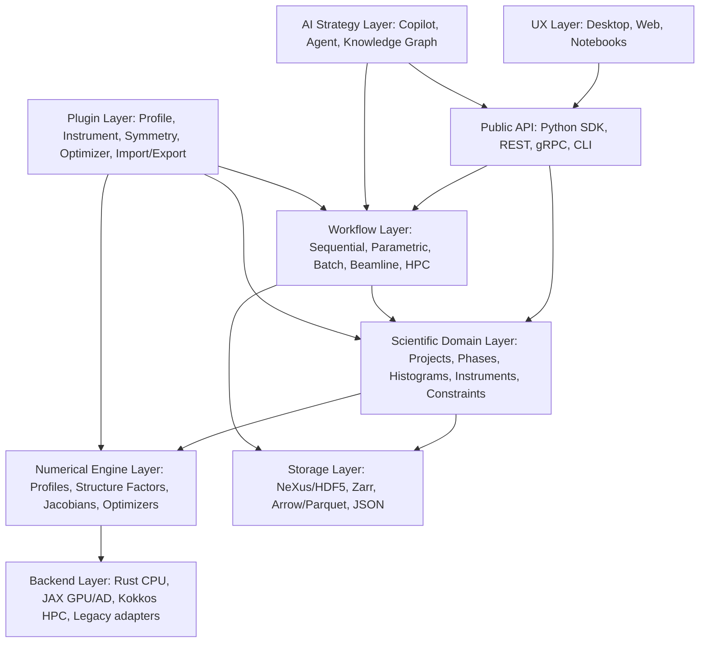

# Part 3: Recommended Architecture

## 3.1 Language Choices

| Language | Strengths | Weaknesses | Recommended role |
|---|---|---|---|
| Python | Scientific ecosystem, scripting, AI tooling, notebooks, GSAS-II and Mantid precedent | Runtime performance, dependency fragility, weak static typing | Scripting, workflows, plugins, AI, reference models |
| Rust | Memory safety, concurrency, strong types, service deployment, good FFI | Smaller scientific/HPC ecosystem | Core model, parameter graph, CPU kernels, provenance, services |
| C++ | Mature HPC, Eigen, Kokkos, performance | Unsafe by default, packaging complexity | Optional high-performance plugin backend |
| Julia | Excellent numerical language and AD | Smaller deployment base at facilities | Research backend/prototyping |

**Recommendation:** Rust core, Python scripting and SDK, TypeScript UI, JAX differentiable backend, optional C++/Kokkos HPC kernels.

## 3.2 Layered Architecture

## 3.3 Numerical Engine Layer

Responsibilities:

- Peak positions for CW, TOF, EDXRD, pink-beam, and transformed axes.
- Profile functions: pseudo-Voigt, Thompson-Cox-Hastings, back-to-back exponentials, TOF pulse-shape kernels, FPA convolution kernels, detector response functions.
- Structure factors for X-ray, neutron nuclear, magnetic neutron, and anomalous X-ray where applicable.
- Background models: polynomial, Chebyshev, spline, physically informed, and constrained learned models.
- Absorption, extinction, preferred orientation, texture, strain, size, and stacking-fault hooks.
- Sparse Jacobian assembly.
- Automatic differentiation and analytic derivative registration.
- Local/global optimization interface.
- Deterministic reproducibility controls.

## 3.4 Scientific Domain Layer

Responsibilities:

- Typed domain entities: Project, Experiment, Dataset, Histogram, Instrument, DetectorBank, Phase, Structure, MagneticStructure, Parameter, Constraint, Recipe, SequentialStudy.
- Symmetry services: space groups, magnetic space groups, superspace groups, constraints.
- CIF/mmCIF/mCIF import/export and validation.
- Shared parameter graph across phases, histograms, and instruments.
- Provenance and audit logs.

## 3.5 Workflow Layer

Responsibilities:

- Refinement recipes.
- Sequential refinement.
- Parametric refinement.
- Batch refinement.
- Multi-start/global search.
- Beamline automation.
- HPC/cloud scheduling.
- Result database and comparison.

## 3.6 AI Layer

Responsibilities:

- Strategy recommendation.
- Failure diagnosis.
- Refinement-order selection.
- Constraint suggestions.
- Phase/model recommendation.
- Report generation.
- Natural-language command interface.
- Human-in-the-loop checkpoints.

## 3.7 UX Layer

Responsibilities:

- Beginner guided workflows.
- Expert parameter graph.
- Real-time visualization.
- Residual, correlation, and covariance diagnostics.
- Sequential dashboards.
- Instrument and phase wizards.
- Reproducibility reports.
