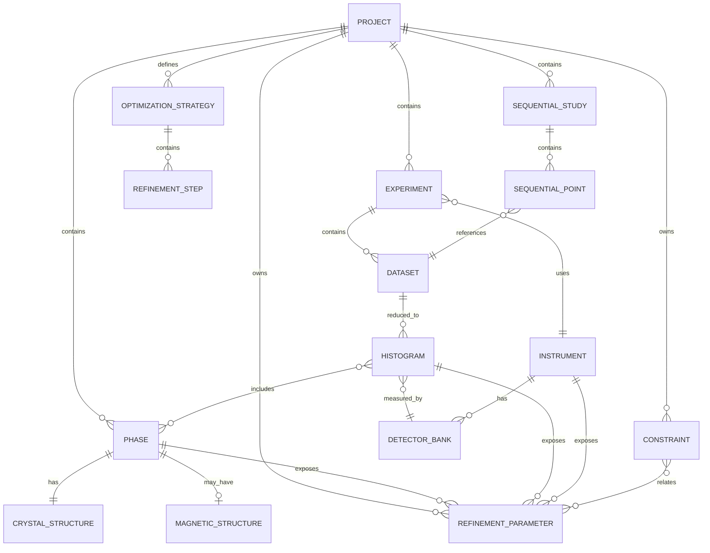

# Part 4: Scientific Data Model

## 4.1 Domain Model



## 4.2 Entities

### Project

Top-level container for model, data, recipes, results, provenance, and environment metadata.

Fields: `id`, `name`, `version`, `experiments`, `phases`, `parameters`, `constraints`, `strategies`, `studies`, `provenance`, `software_environment`.

### Experiment

A physical measurement campaign or collection condition.

Fields: facility, beamline/instrument, proposal, sample environment, radiation type, temperature/pressure/composition/time metadata, calibration references.

### Dataset

Raw or reduced measurement container.

Fields: raw URI, processed URI, axis definitions, uncertainty model, masks/exclusions, monitor normalization, reduction provenance.

### Histogram

Refinement-ready profile.

Fields: x axis, intensity, uncertainty, weights, background model, included phases, bank/instrument model, refinement flags.

### Instrument and DetectorBank

Instrument is a reusable calibrated model. DetectorBank captures bank-specific resolution, zero, scale, absorption, flight path, detector geometry, energy calibration, and masks.

### Phase

Material phase with structural, microstructural, textural, magnetic, and quantitative parameters.

### CrystalStructure

Space group, cell, atom sites, occupancies, ADPs, constraints, restraints, and scattering tables.

### MagneticStructure

Magnetic space group or representation-analysis model, propagation vectors, basis vectors, magnetic moments, and mCIF provenance.

### RefinementParameter

A typed variable in the global parameter graph.

Fields: path, value, uncertainty, bounds, refine flag, prior, units, transform, owner, provenance, correlations.

### Constraint

Symbolic, matrix, inequality, or recipe-level relation among parameters.

### OptimizationStrategy

A reproducible refinement recipe: steps, flags, optimizer, stopping criteria, diagnostics, and rollback rules.

### SequentialStudy

A collection of related datasets with shared model and varying external variables.

## 4.3 Storage Technology Comparison

| Storage | Strengths | Weaknesses | Recommended use |
|---|---|---|---|
| JSON | Human-readable, schema-validatable, Git-friendly | Poor for large arrays | Project metadata, recipes, constraints, provenance |
| HDF5 | Mature binary hierarchy, efficient arrays | Less cloud-native | Local/facility raw and reduced data |
| NeXus | Community standard for neutron, X-ray, and muon data | Not enough alone for all refinement semantics | Facility data interchange |
| Arrow | Fast columnar in-memory analytics | Not ideal as archive format | Parameter tables, residual tables, streaming results |
| Parquet | Efficient compressed columnar storage | Not hierarchical enough for full projects | High-throughput result databases |
| Zarr | Chunked cloud-friendly arrays | Facility adoption still varies | Cloud-native profile arrays and sequential datasets |

**Recommendation:** use a hybrid Rietveld Project Package:

```text
project.rnp/
  project.json
  schema/
  data/
    raw/
    reduced/
    profiles.zarr/
  tables/
    parameters.parquet
    correlations.parquet
    refinements.parquet
  provenance/
    action-log.jsonl
    environment.lock
  reports/
    report.md
    report.html
  cache/
```
