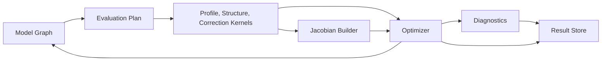
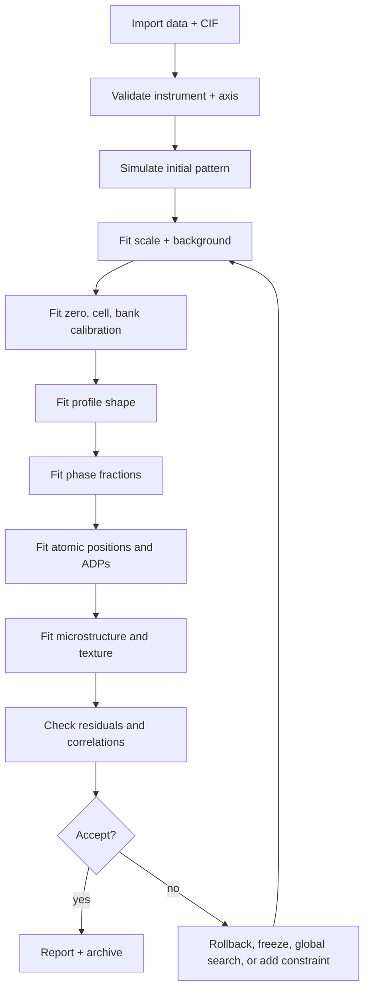

# Part 5: Numerical Engine Design

## 5.1 Backend Comparison

| Backend | Strengths | Weaknesses | Recommendation |
|---|---|---|---|
| NumPy | Universal and stable | CPU-only, limited AD | Reference implementation |
| SciPy | Optimizers, sparse linear algebra | Not GPU-native | Local solver baseline |
| JAX | AD, JIT, vectorization, GPU/TPU | Compilation overhead, irregular kernels need care | Differentiable/GPU backend |
| PyTorch | AD, GPU, ML ecosystem | Less natural for sparse scientific least squares | AI/ML models, not primary engine |
| Rust ndarray | Safe CPU kernels | Smaller scientific ecosystem | Production CPU kernels |
| Eigen | Mature C++ linear algebra | ABI and packaging complexity | Optional plugin backend |
| Kokkos | HPC performance portability | Specialist effort | Facility-scale backend |

## 5.2 Engine Architecture



## 5.3 Required Numerical Features

1. Sparse parameter graph.
2. Region-of-influence profile evaluation.
3. Vectorized reflection batches.
4. Mixed analytic and AD derivatives.
5. Robust invalid-model handling.
6. Deterministic reproducibility.
7. Backend-independent optimizer interface.
8. Scientific validation and golden-pattern regression tests.

## 5.4 Automatic Differentiation Strategy

Use three derivative modes:

1. **Analytic derivatives** for scale factors, background linear parameters, simple peak position terms, common profile width terms, and known symbolic constraints.
2. **AD derivatives** through JAX or Rust AD plugins for smooth custom kernels, instrument parameterizations, EDXRD detector response, and differentiable surrogates.
3. **Sparse finite differences** for legacy plugins, discontinuous model switches, and black-box external engines.

Derivative contract:

```text
KernelDerivative =
  Analytic(fn value_and_jacobian)
  AutoDiff(fn differentiable_value)
  FiniteDifference(step, scheme)
  ExternalJacobian(uri)
```

## 5.5 Optimization Strategy

### Local Refinement

Default local refinement should use bounded sparse trust-region least squares with parameter scaling, robust loss options, dynamic damping, automatic freezing on severe non-identifiability, and final covariance/correlation analysis. LM should be available for small unconstrained expert cases.

### Global Refinement

Global search should combine physics-informed initialization, multi-start sampling, differential evolution for selected parameter groups, surrogate modeling for high-throughput campaigns, and archival of all candidate results.

### Autonomous Refinement


