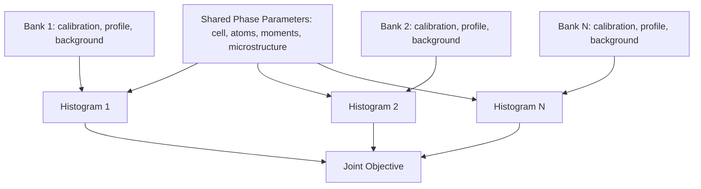

# Part 6: TOF and Neutron Requirements

## 6.1 TOF Modeling

A TOF engine must treat each detector bank as a distinct instrument with its own calibration and resolution model.

Core requirements:

- Independent variables: TOF, d-spacing, Q, wavelength, and optionally 2D angle-wavelength representation.
- Calibration terms: zero, flight path, DIFC/DIFA-like terms, detector angle, and bank offsets.
- Bank-specific profile models.
- Bank-specific background, absorption, normalization, and resolution.
- Shared phase/structure parameters across banks.
- Event-mode reduction provenance.
- Support for fitting reduced histograms now and event-likelihood methods later.

## 6.2 TOF Peak Profile Requirements

- Back-to-back exponential convoluted with Gaussian/Lorentzian broadening.
- Ikeda-Carpenter-like moderator terms where required.
- Bank-dependent asymmetry.
- Wavelength-dependent resolution.
- Pulse-shape models.
- Moderator, chopper, flight-path, and detector timing terms.
- Extensible facility-specific resolution functions.

## 6.3 Multi-Bank TOF Model

## 6.4 Neutron Features

### Nuclear Neutron Diffraction

- Isotope-specific coherent scattering lengths.
- Absorption cross sections and wavelength dependence.
- Multiple scattering hooks.
- Extinction corrections.
- Sample geometry corrections.
- Container/environment contributions.
- Low-count Poisson likelihood support.

### Magnetic Neutron Diffraction

Magnetic refinement must be native:

- Magnetic form factors.
- Propagation vectors.
- Magnetic space groups.
- Magnetic superspace groups.
- Representation-analysis import/export.
- mCIF support.
- Moment constraints by symmetry.
- Coupled nuclear/magnetic phases.
- Polarized-neutron extension hooks.

## 6.5 Joint Refinement

Required combinations:

- CW XRD + CW neutron.
- Synchrotron XRD + TOF neutron.
- Multi-bank TOF neutron.
- TOF + CW neutron.
- XRD + neutron + PDF.
- Nuclear + magnetic refinement.
- Multi-temperature, pressure, or composition sequential studies.

Joint refinement should support shared crystal structures, radiation-specific scattering factors/lengths, histogram-specific scale/background/zero/profile/absorption, shared constraints and priors, and dataset-specific likelihoods.
