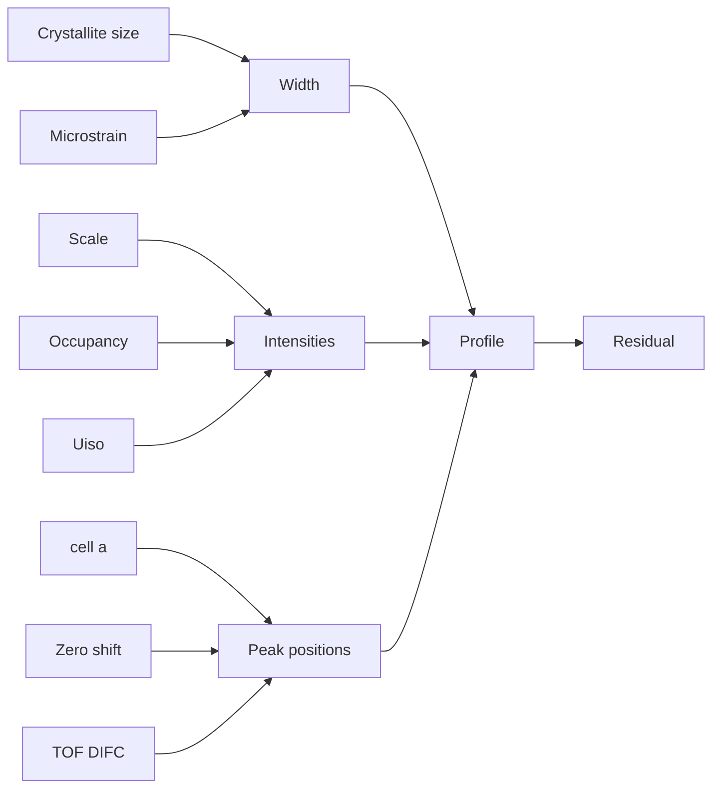

# Part 8: Modern User Experience Design

## 8.1 UX Principles

1. Beginner mode should guide scientific decisions, not hide them.
2. Expert mode should expose the full parameter graph.
3. Every GUI action must produce scriptable provenance.
4. Every refinement step must be reversible.
5. Diagnostics must be visual, quantitative, and explainable.
6. AI suggestions must be optional, auditable, and reproducible.

## 8.2 Beginner Mode

Workflow:

```text
1. Import data
2. Identify instrument, axis, and radiation
3. Import CIF or search phase database
4. Simulate pattern
5. Choose guided recipe
6. Run staged refinement
7. Review diagnostics
8. Export report
```

Beginner screens:

- Data-type wizard.
- Instrument recognition and calibration warning panel.
- CIF validation panel.
- Initial pattern overlay.
- Recommended refinement recipe.
- Plain-language parameter explanation.
- Failure diagnostics.

## 8.3 Expert Mode

Expert mode centers on a parameter dependency graph, not a flat parameter table.



Expert features:

- Parameter graph editor.
- Constraint editor with symbolic validation.
- Correlation heatmap.
- Covariance ellipses.
- Parameter bounds and priors.
- Refinement recipe editor.
- Multi-histogram phase/instrument matrix.
- Manual override of AI recommendations.
- Diff view of refinement states.

## 8.4 Visualization

Required views:

1. Observed/calculated/difference plot.
2. Multi-bank TOF overlay.
3. Reflection tick browser.
4. Residual maps.
5. Covariance/correlation heatmap.
6. Parameter evolution dashboard.
7. Sequential refinement dashboard.
8. Phase-fraction evolution.
9. Lattice-parameter evolution.
10. Microstructure/strain evolution.
11. Magnetic moment evolution.
12. Outlier/mask editor.
13. 2D detector/image reduction viewer.
14. PDF/total-scattering comparison panel.
15. Publication figure composer.

## 8.5 Wireframes

### Beginner Refinement Screen

```text
+-------------------------------------------------------------+
| Project: Battery Cathode  | Mode: Guided | Status: Step 3/8 |
+-------------------------------------------------------------+
| Left: Workflow             | Center: Pattern                |
| [x] Import data            | Obs / Calc / Diff             |
| [x] Import CIF             | ticks by phase                |
| [x] Scale + background     |                               |
| [>] Cell refinement        |                               |
| [ ] Profile shape          |                               |
| [ ] Atomic parameters      |                               |
| [ ] Validate               |                               |
+----------------------------+-------------------------------+
| Right: Recommendation                                      |
| Peak positions are shifted systematically. Refine cell      |
| parameters before profile width. Keep atom positions fixed. |
| Buttons: Run step | Preview parameters | Explain           |
+-------------------------------------------------------------+
```

### Expert Parameter Graph Screen

```text
+-------------------------------------------------------------+
| Parameter Graph | Table | Constraints | Correlations        |
+-------------------------------------------------------------+
| Graph canvas: nodes = parameters, edges = dependencies      |
| Red edges = high correlation; gray nodes = fixed            |
+-------------------------------------------------------------+
| Selected node: /phases/NMC/cell/a                           |
| value, su, bounds, prior, refine flag, correlations         |
+-------------------------------------------------------------+
```
