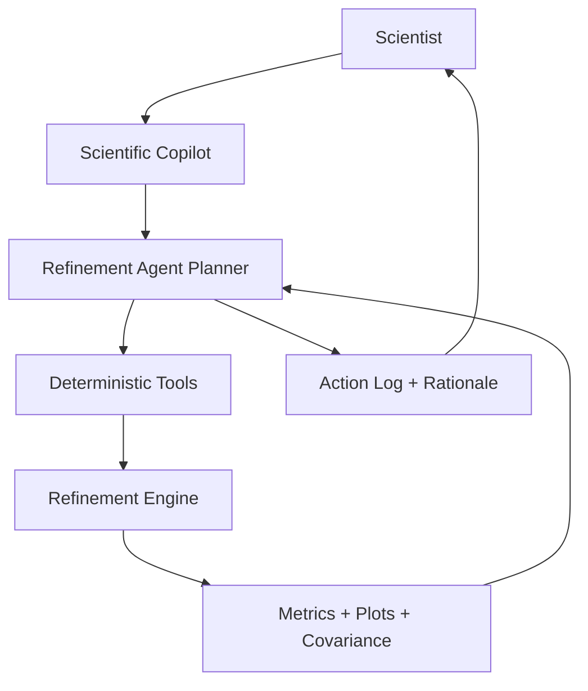

# Part 9: AI-Native Refinement

## 9.1 Integration Model

AI must be a tool-grounded strategy layer, not a hidden numerical engine.

## 9.2 Refinement Agent Capabilities

Tools:

- `import_dataset`
- `validate_axis`
- `import_cif`
- `validate_cif`
- `simulate_pattern`
- `set_refinement_flags`
- `run_refinement`
- `compute_residual_diagnostics`
- `compute_correlation_matrix`
- `detect_nonphysical_parameters`
- `rollback`
- `freeze_parameter`
- `add_constraint`
- `run_global_search`
- `compare_models`
- `generate_report`

Diagnostic abilities:

- Divergence.
- Singular matrix or SVD failure.
- Excessive shift/esd.
- Negative or nonphysical ADPs.
- Impossible occupancies.
- Overfitting.
- Scale/absorption correlation.
- Background absorbing peaks.
- Peak-position mismatch.
- Peak-width mismatch.
- Incorrect phase.
- Missing impurity.
- Wrong radiation/instrument file.
- Bank-specific calibration failure.
- Magnetic model inconsistency.
- Texture/microstructure confounding.

Strategy abilities:

- Refinement order.
- Parameter groups to release.
- Parameters to freeze.
- Bounds and priors.
- Alternative profile model.
- Additional phase search.
- Instrument recalibration.
- Manual review checkpoint.
- Global search when local search stalls.

## 9.3 Scientific Copilot

The copilot should explain parameters, interpret CIF/mCIF files, explain correlations, generate reports, compare competing models, explain residual patterns, produce reproducible scripts from GUI actions, and answer what changed between refinement states.

## 9.4 Trustworthiness Rules

1. AI cannot silently alter data.
2. AI cannot silently accept a final model.
3. Every AI action must be replayable without the LLM.
4. Every model change must have a rationale.
5. LLM text is advisory; numerical results come only from deterministic tools.
6. Reports must distinguish measured facts, refined parameters, assumptions, and AI-generated interpretations.
7. Uncertainty, correlations, and residual diagnostics must be included by default.
